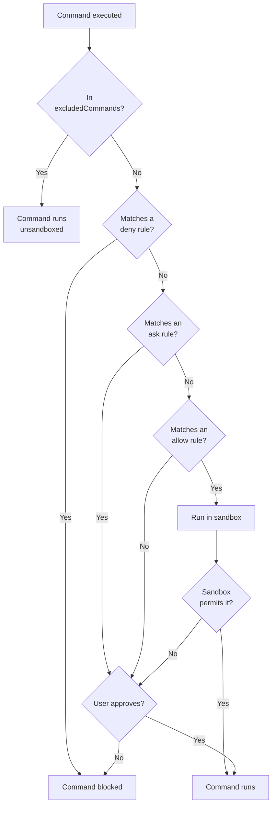

# How to harden Claude Code permissions

Reduce prompt fatigue for safe commands while protecting against destructive operations and prompt injection attacks. This guide covers a three-layer approach: allow rules, deny rules, and OS-level sandboxing. By the end you'll have a `settings.json` that pre-approves safe commands, blocks destructive patterns, and enforces OS-level filesystem and network restrictions.

For official reference, see the Claude Code documentation on [permissions](https://code.claude.com/docs/en/permissions) and [sandboxing](https://code.claude.com/docs/en/sandboxing).

## Why this matters

Claude Code executes shell commands on your machine. The permission system controls which commands run automatically and which require approval. Without configuration, every command prompts you — leading to approval fatigue where you click "yes" without reading.

The deeper concern is **prompt injection**. When Claude reads files, web pages, or MCP responses, adversarial content could manipulate it into running destructive commands. Permission rules are the first line of defense, and sandbox mode is the backstop.

## Prerequisites

- Claude Code installed and configured
- For Linux/WSL2: `bubblewrap` and `socat` installed (`sudo apt-get install bubblewrap socat`)
- For macOS: no additional dependencies (uses built-in Seatbelt)

## Layer 1: Allow rules

Allow rules pre-approve commands so they run without prompting. The guiding principle is to **allow read-only commands and require approval for everything else**.

Add rules to `permissions.allow` in `.claude/settings.json` (project-level) or `~/.claude/settings.json` (user-level). See the [permissions documentation](https://code.claude.com/docs/en/permissions) for full rule syntax.

### Git commands

Pre-approve informational git commands and common operations:

```json
{
  "permissions": {
    "allow": [
      "Bash(git status:*)",
      "Bash(git add:*)",
      "Bash(git checkout:*)",
      "Bash(git branch:*)",
      "Bash(git pull:*)",
      "Bash(git diff:*)",
      "Bash(git push:*)",
      "Bash(git log:*)",
      "Bash(git show:*)",
      "Bash(git rev-parse:*)",
      "Bash(git rev-list:*)",
      "Bash(git stash list:*)"
    ]
  }
}
```

The `:*` suffix is a prefix-match pattern — it matches any arguments after the command. Standalone shell tools use a bare `*` glob instead (e.g. `Bash(grep *)`). Both are wildcards, but the `:*` syntax is specific to subcommand-style tools like `git` and package managers.

### Package manager scripts

Pre-approve standard development scripts across package managers. These entries go inside the `permissions.allow` array shown in the preceding example:

```json
"Bash(pnpm test:*)",
"Bash(pnpm run :*)",
"Bash(pnpm build:*)",
"Bash(pnpm lint:*)",
"Bash(pnpm format:*)"
```

Repeat for `npm`, `yarn`, and `bun` as needed. Also add read-only dependency commands:

```json
"Bash(pnpm list:*)",
"Bash(pnpm outdated:*)"
```

### Shell tools

Pre-approve common read-only shell commands:

```json
"Bash(grep *)",
"Bash(tail *)",
"Bash(cat *)",
"Bash(find *)",
"Bash(ls *)",
"Bash(wc *)",
"Bash(which *)",
"Bash(diff *)",
"Bash(jq *)",
"Bash(shellcheck *)"
```

> Avoid pre-approving `env` or `printenv` — Claude Code could use them to read secrets and credentials from the environment.

### GitHub CLI

Pre-approve read-only `gh` commands:

```json
"Bash(gh run list *)",
"Bash(gh run view *)",
"Bash(gh pr view *)",
"Bash(gh pr list *)",
"Bash(gh issue view *)",
"Bash(gh issue list *)",
"Bash(gh api --method GET *)"
```

`gh api` is restricted to `--method GET` — mutating API calls still require approval. Since Claude Code doesn't include `--method GET` by default when making read-only API calls, add an instruction to your user-level `CLAUDE.md` to enforce this:

```markdown
## GitHub CLI (`gh`) permissions

Read-only `gh api` calls are pre-approved only when `--method GET` is explicitly included.
Always pass `--method GET` when making read-only API calls, e.g.:

    gh api --method GET repos/owner/repo/actions/runs
```

### MCP tools

MCP tools use the same permission syntax. Pre-approve read-only tools by their full identifier:

```json
"mcp__plugin_github_github__issue_read",
"mcp__plugin_github_github__pull_request_read",
"mcp__plugin_playwright_playwright__browser_snapshot",
"mcp__plugin_playwright_playwright__browser_console_messages",
"mcp__plugin_playwright_playwright__browser_take_screenshot"
```

The pattern is `mcp__<server>__<tool-name>`. Only approve tools that are strictly read-only or passive — for example, Playwright's snapshot and screenshot tools are safe, but interaction tools like `browser_click` or `browser_fill_form` have side effects and should stay gated behind approval.

## Layer 2: Deny rules

Allow rules match the **start** of a command string. This means `Bash(git push:*)` also approves `git push --force`. Deny rules override allow rules to block specific destructive patterns.

Add rules to `permissions.deny`:

```json
{
  "permissions": {
    "deny": [
      "Bash(git push *--force*)",
      "Bash(git push *-f *)",
      "Bash(git push *--delete*)",
      "Bash(git push * :*)",
      "Bash(git checkout *-- *)",
      "Bash(git checkout *.)",
      "Bash(git branch *-D *)",
      "Bash(git branch *--delete --force*)"
    ]
  }
}
```

These block:

| Pattern | Prevents |
| --- | --- |
| `git push --force` / `-f` | Overwriting remote history |
| `git push --delete` / `origin :branch` | Deleting remote branches |
| `git checkout -- <file>` / `git checkout .` | Discarding uncommitted changes |
| `git branch -D` | Force-deleting unmerged branches |

Denied commands are blocked entirely — Claude Code can't execute them at all. If you want a confirmation prompt instead of a hard block, use [`permissions.ask`](https://code.claude.com/docs/en/permissions) rather than `permissions.deny`. Rules are evaluated in strict precedence: **deny → ask → allow**.

### Limitation: command chaining

Deny rules match against the full command string, but they can't cover every destructive pattern. A chained command like `cat foo; rm -rf /` starts with `cat`, so it matches the `cat` allow rule. This is where Layer 3 becomes essential.

## Layer 3: Sandbox mode

Sandbox mode enforces **OS-level** restrictions on all bash commands and their subprocesses. Unlike permission rules (which are string-matching), sandbox restrictions apply to the process itself — they can't be bypassed by command chaining, subshells, or piped commands. See the [sandboxing documentation](https://code.claude.com/docs/en/sandboxing) for full configuration reference.

### Enable sandbox

```json
{
  "sandbox": {
    "enabled": true,
    "excludedCommands": ["git push", "git fetch", "git pull", "git clone"],
    "network": {
      "allowUnixSockets": ["~/.ssh/agent.sock"]
    },
    "filesystem": {
      "allowWrite": ["/tmp", "~/.local/share/pnpm", "~/.npm", "~/.yarn", "~/.bun/install"],
      "denyRead": ["~/.ssh", "~/.gnupg", "~/.aws/credentials"],
      "allowRead": ["~/.ssh/known_hosts", "~/.ssh/config", "~/.ssh/agent.sock"],
      "denyWrite": ["~/.ssh", "~/.gnupg", "~/.bashrc", "~/.zshrc", "~/.profile"]
    }
  }
}
```

### What sandbox enforces

**Filesystem:**

- **Write** is restricted to the current working directory by default. Use `allowWrite` to grant access to additional paths like `/tmp` and package manager stores.
- **`denyRead`** blocks reads to sensitive directories. Use `allowRead` to punch holes for specific files that tools need — for example, SSH needs `~/.ssh/known_hosts` and `~/.ssh/config` even though `~/.ssh` is denied as a whole. `allowRead` takes precedence over `denyRead` for matching paths.
- **`denyWrite`** protects shell config files and credential directories from modification.

**Network:**

- All outbound HTTP/HTTPS traffic routes through a proxy that only allows approved domains
- New domains trigger a permission prompt
- Applies to all subprocesses — a malicious `npm postinstall` script can't phone home to an unapproved domain
- SSH traffic (port 22) can't go through the HTTP proxy. Use `excludedCommands` for commands that need SSH access (like `git push`). These commands run outside the sandbox.
- Use `allowUnixSockets` to permit connections to specific sockets, like an SSH agent.

**Escape hatch:**

When a sandboxed command fails, Claude Code can retry it with `dangerouslyDisableSandbox`, which runs the command completely outside the sandbox. If the command matches a `permissions.allow` rule, this happens without any prompt — Claude Code silently bypasses the sandbox.

This is controlled by `sandbox.allowUnsandboxedCommands` (defaults to `true`). Set it to `false` to disable this escape hatch entirely. Any command that can't run inside the sandbox must either be listed in `excludedCommands` or it fails.

| Setting | Role |
| --- | --- |
| `excludedCommands` | Commands that always run outside the sandbox |
| `sandbox.allowUnsandboxedCommands` | Whether Claude can retry failed commands outside the sandbox (default: `true`) |

For strict environments, set `sandbox.allowUnsandboxedCommands` to `false` and use `excludedCommands` for known-incompatible tools instead.

### SSH and the sandbox

The `denyRead` rule on `~/.ssh` blocks direct key file access, which breaks SSH authentication. The recommended solution is to use an external SSH agent (like 1Password) that authenticates through a Unix socket instead of reading key files.

This requires several sandbox adjustments:

- **`allowRead`** for `~/.ssh/known_hosts`, `~/.ssh/config`, and the agent socket (overrides `denyRead`)
- **`allowUnixSockets`** to permit the agent socket connection
- **`excludedCommands`** for `git push`, `git fetch`, `git pull`, and `git clone` — SSH uses port 22, which the sandbox's HTTP proxy can't handle, so these commands run outside the sandbox

See [How to set up 1Password SSH agent for Claude Code sandbox](1password-ssh-agent-setup.md) for the full setup (covers macOS and WSL2).

### Platform requirements

| Platform | Runtime | Installation |
| --- | --- | --- |
| macOS | Apple Seatbelt | Built-in, no action needed |
| Linux / WSL2 | bubblewrap | `sudo apt-get install bubblewrap socat` |
| WSL1 | Not supported | Lacks required kernel features |

### Verify installation (Linux/WSL2)

```bash
which bwrap && bwrap --version
which socat
```

## How the layers work together



Rules are evaluated in precedence order: `excludedCommands` → deny → ask → allow. Denied commands are blocked outright. The sandbox is the final gate — even an approved command is restricted to the sandbox's filesystem and network boundaries.

## Adapting for your setup

### Identify your read-only MCP tools

List your MCP servers and categorize each tool as read-only or mutating. Only pre-approve read-only tools. When in doubt, leave it gated — you can always approve on a case-by-case basis.

### Identify your destructive command variants

For every command you allow, ask: "What arguments would make this destructive?" Add deny rules for those patterns. Common examples:

- `rm` with `-rf` or `-f` flags
- `docker` with `system prune`, `rm`, or `rmi`
- `kubectl delete`

### Customize sandbox filesystem rules

The sandbox restricts writes to the current working directory by default. Package managers need write access to their global stores — add these to `allowWrite`:

- `~/.local/share/pnpm` — pnpm store
- `~/.npm` — npm cache
- `~/.yarn` — Yarn cache
- `~/.bun/install` — Bun install cache
- `/tmp` — temp directory used by many tools

Adapt `denyRead` and `denyWrite` to your environment. Consider adding:

- `~/.kube/config` — Kubernetes credentials
- `~/.docker/config.json` — Docker registry credentials
- `~/.npmrc` — npm auth tokens
- `~/.netrc` — general network credentials
- Any project-specific secrets directories

### Project-level vs user-level settings

| Scope | File | Use case |
| --- | --- | --- |
| User-level | `~/.claude/settings.json` | Personal defaults across all projects |
| Project-level | `.claude/settings.json` | Shared team configuration, checked into git |
| Local overrides | `.claude/settings.local.json` | Personal project overrides, git-ignored |

Project-level settings are ideal for sharing a team baseline. Individual developers can extend with user-level settings or override with local settings.

## Bootstrap with Claude Code

You can use Claude Code itself to audit your setup and generate the configuration. Paste the following prompt into a session:

```text
Review my Claude Code security configuration in .claude/settings.json and suggest improvements:

1. List all available MCP tools and categorize each as read-only or mutating.
   Add read-only tools to permissions.allow.

2. For every command currently in permissions.allow, identify argument patterns
   that would be destructive (e.g. --force, --delete, -rf). Add those patterns
   to permissions.deny.

3. Review my home directory for files containing credentials or secrets
   (SSH keys, API tokens, cloud provider configs, auth tokens).
   Add those paths to sandbox.filesystem.denyRead and denyWrite as appropriate.

Do not remove any existing rules. Present the changes as a diff before applying.
```

This gives Claude Code the context to tailor the configuration to your specific environment — your MCP servers, your tools, and your filesystem.
